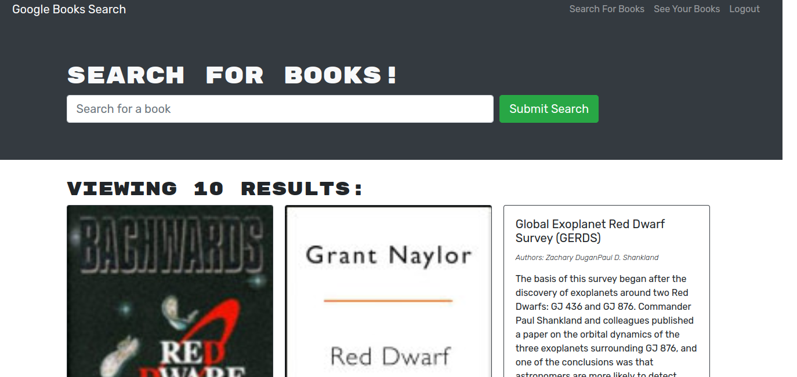

# Google Book Search

---------------------------------------

## Description

This search site accesses the Google Books API.  Users can add or delete books from their personal book list stored in local memory.

This application can be used via the website, or the repo can be cloned for use offline.  This requires having Node, npm and MongoDB installed first.

Once the repo is cloned and, naviagete to the folder in the command line and run 

`$ npm install`

`$ npm start`

---------------------------------------

Project Link: 
[Google Book Search](https://powerful-hollows-26718.herokuapp.com/)

---------------------------------------

Written using:

                    
* JavaScript

* React
   
* Node
   
* Apollo

* Express

* Mongoose/MongoDB

* graphql

---------------------------------------

---------------------------------------

## Questions

For any input, concerns, bugs or questions please get in touch!  Simply reach out to [Nina Cummings](https://github.com/jaderiver62/) via GitHub or via e-mail: jaderiver64@gmail.com.

---------------------------------------

## Licence

#### This project is licensed under the [MIT License](https://opensource.org/licenses/MIT).
#### &copy; 2021 Nina Cummings

---------------------------------------
    